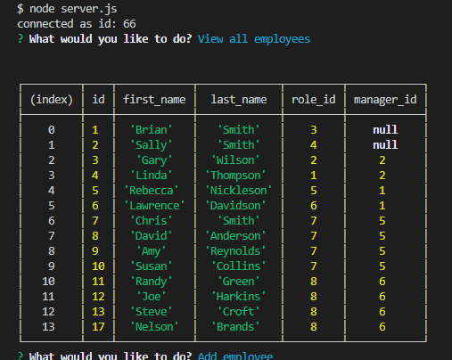
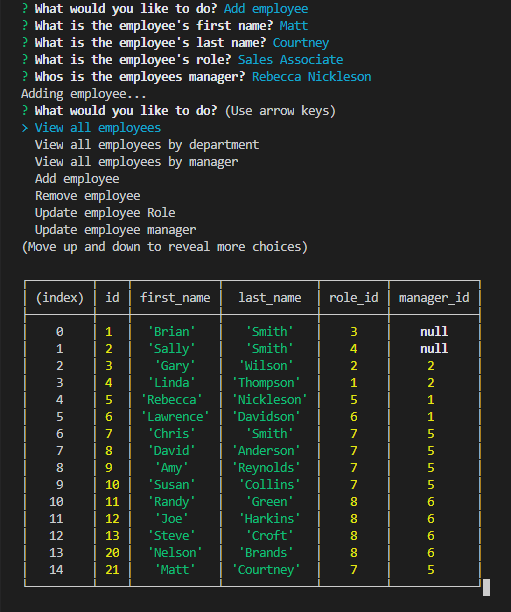
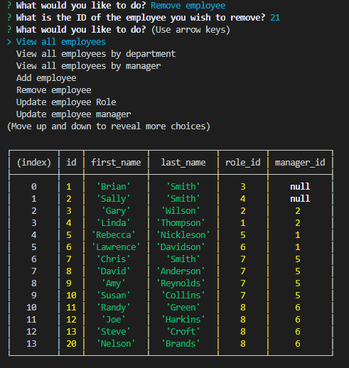

# SQL Employee Tracker

## Purpose
As I go through my coursework a second time I have arrived at the mySQL chapter. This is the homework assignment for the chapter and it called for me to create a node based app to managable database for a small business. Since this is the bootcamps first database project the assignment was simple enough it called for basic CRUD operations to be performed. 

## Process
This project left alot to interprutation but I took a similar approach to what I did in the first go around. I used inquirer to determine what a user wanted to do. Once I had the users input I fired a function cooresponding to the input. I then used mysql to extablish a connction and render a query that would perfom various CRUD operations. This project was a perfect refresher to SQL and really helped me nail down the basics of databases. I found everything much easier to understand from joins to renaming columns this really helped alot. 

## Languages 
JavaScript 
 
HTML 
 
CSS 

## Links
[GitHub](https://github.com/sharkattack182/sql-employee-tracker)
 
To download this file please click the green code button above.

## Visuals

 

 

